# Architecture Diagrams

Visual representations of MongoDB cluster architectures supported by this role.

## Replica Set Architecture

A standard 3-node replica set with automatic failover:

```mermaid
graph TB
    subgraph "MongoDB Replica Set"
        direction TB
        P[("🟢 Primary<br/>mongo1:27017")]
        S1[("🔵 Secondary<br/>mongo2:27017")]
        S2[("🔵 Secondary<br/>mongo3:27017")]
        
        P <-->|"Replication<br/>(oplog)"| S1
        P <-->|"Replication<br/>(oplog)"| S2
        S1 <-.->|Heartbeat| S2
    end
    
    subgraph "Applications"
        APP1[App Server 1]
        APP2[App Server 2]
        APP3[App Server 3]
    end
    
    APP1 -->|"Read/Write"| P
    APP2 -->|"Read/Write"| P
    APP3 -->|"Read/Write"| P
    
    APP1 -.->|"Read (secondary)"| S1
    APP2 -.->|"Read (secondary)"| S2
```

## Sharded Cluster Architecture

Horizontally scalable sharded cluster:

## High Availability with DR

Cross-datacenter deployment with delayed secondary:

```mermaid
graph TB
    subgraph "Primary Datacenter (DC1)"
        direction TB
        P1[("🟢 Primary<br/>priority: 2")]
        S1[("🔵 Secondary<br/>priority: 1")]
    end
    
    subgraph "Secondary Datacenter (DC2)"
        direction TB
        S2[("🔵 Secondary<br/>priority: 1")]
        S3[("⏱️ Delayed Secondary<br/>delay: 1 hour<br/>priority: 0")]
    end
    
    P1 <-->|"Sync Replication"| S1
    P1 <-->|"Async Replication"| S2
    P1 <-->|"Delayed Replication"| S3
    
    S1 <-.->|Heartbeat| S2
    S2 <-.->|Heartbeat| S3
```

## Monitoring Architecture

Complete monitoring stack:

## Backup Architecture

Automated backup flow:

## PITR (Point-in-Time Recovery) Flow

## Network Security

Firewall and network configuration:

## Deployment Pipeline

CI/CD workflow for role deployment:

