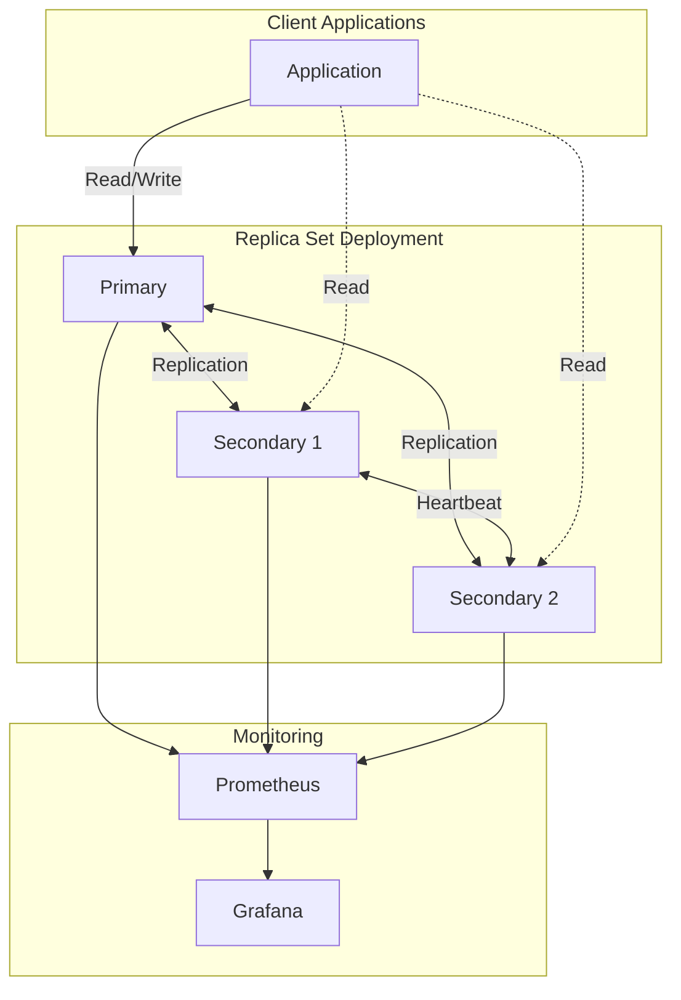

# Ansible MongoDB Cluster

[](https://github.com/faiss97/ansible-mongodb-cluster/actions/workflows/ci.yml)
[](https://galaxy.ansible.com/faiss97/ansible_mongodb_cluster)
[](https://github.com/faiss97/ansible-mongodb-cluster/blob/main/LICENSE)

**Production-ready Ansible role for deploying and managing MongoDB clusters.**

---

## 🚀 Features

<div class="grid cards" markdown>

-   :material-server-network:{ .lg .middle } **Multiple Deployment Modes**

    ---

    Deploy standalone instances, replica sets with automatic failover, or horizontally scalable sharded clusters.

    [:octicons-arrow-right-24: Deployment Modes](deployment/overview.md)

-   :material-shield-lock:{ .lg .middle } **Security First**

    ---

    Built-in authentication, TLS/SSL encryption, keyfile management, and LDAP/Kerberos support.

    [:octicons-arrow-right-24: Security](configuration/security.md)

-   :material-backup-restore:{ .lg .middle } **Automated Backups**

    ---

    Scheduled backups with retention policies, S3 integration, and point-in-time recovery.

    [:octicons-arrow-right-24: Backup & Restore](operations/backup.md)

-   :material-chart-line:{ .lg .middle } **Monitoring & Alerting**

    ---

    Prometheus exporters, Grafana dashboards, and multi-channel alerting (Slack, PagerDuty, Teams).

    [:octicons-arrow-right-24: Monitoring](operations/monitoring.md)

</div>

## Quick Start

### Installation

```bash
# From Ansible Galaxy
ansible-galaxy install faiss97.ansible_mongodb_cluster

# From GitHub
git clone https://github.com/faiss97/ansible-mongodb-cluster.git
```

### Basic Usage

```yaml
- hosts: mongodb
  become: true
  roles:
    - role: faiss97.ansible_mongodb_cluster
      vars:
        mongodb_version: "7.0"
        mongodb_deployment_mode: "replicaset"
        mongodb_replicaset_name: "rs0"
```

[:octicons-arrow-right-24: Complete Quick Start Guide](getting-started/quickstart.md)

## Architecture Overview



## Supported Platforms

| Platform | Versions |
|----------|----------|
| Ubuntu | 20.04, 22.04, 24.04 |
| Debian | 11, 12 |
| RHEL | 8, 9 |
| Rocky Linux | 8, 9 |
| AlmaLinux | 8, 9 |

## Requirements

- Ansible >= 2.12
- Python >= 3.8
- Collections: `community.mongodb`, `ansible.posix`, `community.general`

## License

This project is licensed under the MIT License - see the [LICENSE](https://github.com/faiss97/ansible-mongodb-cluster/blob/main/LICENSE) file for details.

## Author

**faiss97** - [GitHub](https://github.com/faiss97)

---

<div class="grid cards" markdown>

-   :material-book-open-variant:{ .lg .middle } **Need Help?**

    ---

    Check out our comprehensive documentation or open an issue on GitHub.

    [:octicons-arrow-right-24: Documentation](getting-started/installation.md)

-   :material-github:{ .lg .middle } **Contribute**

    ---

    We welcome contributions! Please read our contributing guidelines.

    [:octicons-arrow-right-24: Contributing](contributing/guidelines.md)

</div>
